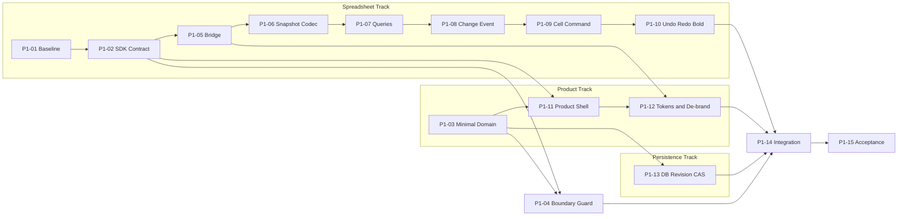

# Phase 1 Internal MVP 实施任务

## 1. Phase 1 Goal

Phase 1 只交付一个内部可用闭环：用户进入我们自己的台账页面，创建“部门月度费用台账”，打开其 Workbook，编辑普通单元格和基础公式，执行撤销、重做、粗体，手动保存为新的不可变 Revision，并能重新打开已保存内容。并发编辑以简单 CAS 返回 `409 REVISION_CONFLICT`，不静默覆盖。

页面使用产品 Header、Ledger Header 和只有 Undo、Redo、Bold 的自有 Spreadsheet Toolbar；Save 属于 Ledger Application。Luckysheet 仅存在于 Spreadsheet SDK 内部的 Legacy Bridge，Phase 1 仍是原 SDK 方案定义的实验性单实例接入，不宣称完成多实例 SDK。

Phase 1 的产品结果是 Internal MVP，不是完整 Spreadsheet SDK、Ledger Beta 或生产发布版。现有 [Master Roadmap](./next-stage-tasks.md) 继续保留，延期能力见 [future-backlog.md](./future-backlog.md)。

## 2. Non Goals

Phase 1 不实现以下能力；对应工作保留在 future backlog：

- Workflow Engine、submission、审批模式、Worker、Outbox、Inbox、Webhook、签名、重试和对账。
- 附件、对象存储、Snapshot 上传凭证、图片资产生命周期。
- 自动保存、离线编辑、崩溃恢复、ChangeSet、增量保存、协同编辑。
- 字段抽取、Record 引擎、BindingMap 结构变换、统计报表、复杂 Field/Range ACL、敏感字段 ReadView。
- XLSX 导入导出、打印、图表、透视表、图片和批注产品化、数据验证、条件格式。
- 完整 Toolbar、行列/合并/筛选/排序等高级结构操作、深度 Canvas Theme。
- 移动端编辑、全面 TypeScript、全面移除 jQuery、全量 class rename、更换引擎或构建体系。

所有未实现能力通过 `supported: false`、`enabled: false` 或稳定 `UNSUPPORTED_COMMAND` 明确表达。Phase 1 页面不渲染看似可用的空按钮，不使用旧 Toolbar 补齐缺失能力。

## 3. Architecture Boundaries

```text
Ledger Application
├── Product Shell / Ledger Header / Save
├── Ledger Domain / LedgerRepository
│   └── DatabaseSnapshotRepository（Phase 1）
└── Spreadsheet SDK facade
    └── Luckysheet Legacy Bridge
        └── Luckysheet Runtime（实验性单实例）

WorkflowPort（只保留设计扩展位；Phase 1 不写生产实现）
```

必须遵守以下依赖方向：

- Ledger Application 只通过公开 `SpreadsheetInstance` 调用表格，不 import Store、controller、`src/global/api`，不读取或点击 `.luckysheet-*` DOM。
- 自有 Toolbar 只调用 `execute()`、`undo()`、`redo()` 和查询接口。Save 调用 Ledger Repository/API，不是 Spreadsheet Command。
- Legacy Bridge 是 Phase 1 唯一允许接触 `window.luckysheet`、旧 API 和内部配置的区域；业务 DTO 不暴露旧对象引用。
- Ledger Repository 接口不绑定数据库产品；Phase 1 用数据库内联 Snapshot，未来可替换 SnapshotRepository 实现。
- Spreadsheet 只接收 `readonly` 和已计算 capability，不查询用户、角色或权限数据库。
- WorkflowPort 当前没有运行时使用者；不为占位接口创建 Worker、表、endpoint 或 adapter。

当前仓库未发现服务端工程、数据库 schema、ORM 配置或 migration，因此 P1-13 标记 **BACKEND CHOICE REQUIRED**。实施前必须由现有宿主系统确定后端语言、数据库及认证上下文；本计划不授权为了 MVP 引入复杂后端框架。

当前仓库也没有产品 Shell 工程。若组织已有宿主应用，P1-11 在该应用实现；若没有，使用与现有仓库最小兼容的框架无关页面，不为 Shell 单独引入 UI 框架或更换构建体系。

## 4. MVP Data Model

Phase 1 不把 Luckysheet JSON 当 Ledger，只保留四个必要概念：

```ts
interface LedgerDefinitionVersion {
  id: string;
  code: string;
  name: string;
  version: number;
  templateSnapshot: SpreadsheetSnapshot;
}

interface LedgerInstance {
  id: string;
  definitionVersionId: string;
  name: string;
  department?: string;
  period?: string; // 示例使用 YYYY-MM；不建立通用字段系统
  status: "draft";
  headRevision: number;
  createdAt: string;
  updatedAt: string;
}

interface LedgerRevision {
  id: string;
  ledgerId: string;
  revision: number;
  snapshot: SpreadsheetSnapshot;
  createdBy: string;
  createdAt: string;
}
```

`SpreadsheetSnapshot` 沿用既有 SDK 文档的版本外壳：`schemaVersion + dataFormat + workbook + extensions`。`dataFormat: "luckysheet"` 是 codec 兼容标记，不是 Ledger 领域模型。

“部门月度费用台账”只作为一个固定 DefinitionVersion fixture：固定模板包含普通输入单元格和一个基础公式。`department`、`period` 可放在 LedgerInstance 元数据。Phase 1 不抽取业务字段、不生成 Record、不支持用户改变模板结构，因此不需要运行时 BindingMap。未来增加字段/记录绑定时，可给 LedgerRevision 增加可选、版本化的 binding 数据，不改变 SnapshotRepository 的职责。

DefinitionVersion 在 Phase 1 由 fixture/seed 提供，不建设定义编辑、发布、继承或迁移 UI。一个 LedgerInstance 固定引用创建时的 DefinitionVersion。

## 5. MVP Save Model

### 5.1 存储选择

Phase 1 使用关系数据库中的 `ledger_instance` 与 `ledger_revision`：

- `ledger_instance.head_revision` 保存当前整数 Revision。
- `ledger_revision.snapshot` 直接保存完整 Snapshot JSON；具体使用 JSON、JSONB 或 Text 由已选数据库能力决定。
- 唯一约束至少覆盖 `(ledger_id, revision)`；旧 Revision 只读且永不覆盖。
- `template_snapshot` 同样可以内联数据库。没有真实 fixture 体积证据支持提前采用对象存储。

应用层依赖 `SnapshotRepository`/`LedgerRepository`，Phase 1 实现 `DatabaseSnapshotRepository`。未来 `ObjectStorageSnapshotRepository` 可以替换正文存储，而创建、打开和保存用例不改变。Object Storage、上传凭证、candidate hash 和 manifest upload 全部延期。

### 5.2 最小 CAS 协议

```json
POST /ledgers/{ledgerId}/revisions
{
  "baseRevision": 5,
  "snapshot": { "schemaVersion": 1, "dataFormat": "luckysheet" }
}
```

服务端在一个数据库事务内：

1. 读取并锁定 LedgerInstance，重新检查 `canSave`。
2. 若 `head_revision != baseRevision`，不写任何数据，返回 `409 REVISION_CONFLICT`，并提供当前 `headRevision`。
3. 插入不可变 Revision `baseRevision + 1`。
4. 以 `head_revision = baseRevision` 为条件更新实例 head 和 updatedAt。
5. 任一步失败则事务回滚；成功返回新 Revision。

Phase 1 不发送 `expectedHeadRevisionId`、`expectedLedgerVersion`、`policyVersion`、`clientSessionId`、`clientEditSeq`、candidate upload 或 sha256。手动保存只有一个请求在途；网络结果不确定时先重新读取 head，不盲目重试。Snapshot 大小上限和 schemaVersion 校验仍是输入安全要求，不属于复杂版本协议。

创建 Ledger 时，在同一事务创建 instance 和 revision 1；revision 1 保存 DefinitionVersion 的 templateSnapshot，headRevision=1。打开 Ledger 读取 instance、当前 revision、capabilities 和 Snapshot。读取旧 Revision 只需要支持按 revision 获取当前用户有权查看的 Snapshot；Phase 1 不做修订列表、diff 或 restore。

## 6. MVP Permission Model

```ts
interface LedgerCapabilities {
  canView: boolean;
  canEdit: boolean;
  canSave: boolean;
  canCreate?: boolean;
}
```

- capabilities 由 Ledger 后端或 Phase 1 Repository adapter 根据可信用户上下文计算，Spreadsheet 不查询角色数据库。
- `canView=false` 时不返回 Snapshot；`canEdit=false` 时 SDK 以 readonly 创建；`canSave=false` 时 Save 不可用且服务端保存再次拒绝。
- `canSave` 不隐含客户端可绕过 `canEdit` 修改任意 Snapshot；Phase 1 内部用户策略应保持 `canSave => canEdit => canView`。
- 暂不实现 Range/Field ACL、策略版本、角色合并、局部隐藏或部分 Snapshot。接口保留未来增加细粒度规则的扩展位置，但不创建无使用者的策略框架。

## 7. UI Scope

```text
┌──────────────── Product Header ────────────────┐
│ 产品中性名称                                   │
├──────────────── Ledger Header ────────────────┤
│ 台账名称 | draft | Revision N | 保存状态 | 保存 │
├──────────── Spreadsheet Toolbar ──────────────┤
│ Undo | Redo | Bold                             │
├──────────────── Spreadsheet Area ─────────────┤
│ SDK Formula Bar（保留）                        │
│ Grid                                            │
│ SDK Sheet Bar（保留）                          │
└────────────────────────────────────────────────┘
```

页面状态限定为 loading、ready-clean、ready-dirty、saving、save-failed、conflict、forbidden。只有服务器成功返回新 Revision 才显示“已保存”。冲突后停止保存，保留屏幕内容，提供重新打开当前服务器版本的明确操作；Phase 1 不做自动合并。

Product Toolbar 只展示 Undo、Redo、Bold。Undo/Redo disabled 状态来自 `getCapabilities()/history state`，Bold 的 checked/mixed 状态来自 selection state；按钮不读取旧 class。Save 位于 Ledger Header，其 enabled 状态由 canSave、dirty、saving、conflict 共同计算。

Phase 1 保留 SDK Formula Bar 与 Sheet Bar，因为基础公式和工作表导航属于 Spreadsheet 核心 UI。原 Info Bar 和原 Toolbar 关闭。左 Navigation、Workflow/Attachment/History Panel、复杂 Inspector 和全屏模式延期。

## 8. De-brand Scope

Legacy Bridge 内部生成固定 Phase 1 preset：

- `showinfobar=false`、`showtoolbar=false`、`showtoolbarConfig=[]`。
- `userInfo=false`、`functionButton=""`，使用产品传入的中性名称。
- `plugins=[]`，禁用旧图表、导出、打印和未知插件。
- `allowUpdate=false`，`loadUrl/loadSheetUrl/updateUrl/updateImageUrl` 为空；数据只由 facade `load()` 提供。
- Sheet Bar 和 Formula Bar 保留；底部任意加行、旧打印视图等非 MVP 控件关闭。

产品 `<title>` 使用中性名称。正常 MVP 路径不出现 Logo、Lucky 用户、Luckysheet Demo、上游帮助链接或带内部名称的原始错误。Facade 把创建、加载、单元格命令及 unsupported 错误映射为产品错误码/文案；未迁移的旧弹窗路径不应由 Phase 1 UI 触发。

内部 `luckysheet-*` class、文件名、bridge 调用、source map 和 LICENSE 中的来源允许保留。法律许可和第三方归属不属于用户界面去品牌任务。

## 9. Task DAG

任务采用三条并行路线。P1-02 完成后即可并行推进 Bridge、Domain 和 Shell；P1-13 等待真实后端选择，不阻塞前端先用 Mock Repository 展示产品页面。



关键路径通常是 `P1-01 → P1-02 → P1-05 → P1-06 → P1-07 → P1-08 → P1-09 → P1-10 → P1-14 → P1-15`。P1-03/P1-11、P1-04、P1-12 和 P1-13 可在依赖满足后与 Spreadsheet Track 并行。

## 10. Implementation Tasks

以下恰好 15 个叶子任务。任务中的拟建路径是逻辑边界；实施时应结合确定的宿主项目落位，不为了匹配路径重构整仓。

### P1-01 Engine baseline fixture

- **目标**：建立固定双 Sheet 费用台账 fixture 和最小浏览器基线，记录 create、基础公式、普通编辑、undo/redo、bold、snapshot、destroy 的实际现状。
- **涉及模块**：新增测试/fixture/测试页；只读使用 `src/core.js`、`src/global/api.js` 定位行为。
- **前置**：无。
- **风险**：测试误用 demo plugin、旧网络或把已知缺陷确立为规范。
- **测试**：浏览器中固定输入、公式结果和销毁后的 DOM/事件；Network 记录不得依赖 demo server/CDN。
- **验收**：每项标为通过/已知失败/未覆盖；测试可重复运行，公式按值检查而非截图。
- **明确不做**：不修复引擎、不加入 Ledger 页面、不做性能或多实例验收。
- **回滚**：删除独立 fixture/测试入口即可。
- **Luckysheet Core**：否。

### P1-02 Spreadsheet SDK facade contract

- **目标**：定义 `create/destroy/load/getSnapshot/setCellValue/execute/undo/redo/getSelection/getCapabilities/on`、Snapshot、错误和 unsupported 契约，并提供 Fake 实现供 Shell 开发。
- **涉及模块**：新增 SDK contracts/fake；不导出旧 Store/API 类型。
- **前置**：P1-01 的行为事实。
- **风险**：把旧同步函数包装后假装符合异步/事务契约；Fake 对未知命令假成功。
- **测试**：contract suite 同时运行 Fake；unknown command、readonly、destroyed、invalid snapshot 有稳定错误。
- **验收**：宿主只获得公开实例；已实现 capability 与未实现 capability 可区分；Snapshot 返回副本。
- **明确不做**：插件、范围权限、完整命令目录、多实例承诺。
- **回滚**：独立 contract 模块可移除，不影响旧入口。
- **Luckysheet Core**：否。

### P1-03 Minimal Ledger Domain

- **目标**：定义四个最小模型和“部门月度费用台账”DefinitionVersion fixture，明确 Snapshot 不是 Ledger。
- **涉及模块**：新增 Ledger domain schema/fixture/纯校验。
- **前置**：无；Snapshot 类型最终引用 P1-02。
- **风险**：提前引入 Field/Range/Record/Workflow 属性，或把坐标当业务身份。
- **测试**：接受合法 definition/instance/revision；拒绝重复版本、缺 definition、非法 headRevision 和未知 snapshot schema。
- **验收**：fixture 能创建 revision 1；模型字段不超过 §4 所需范围，department/period 只是实例元数据。
- **明确不做**：BindingMap、Record、字段抽取、定义发布 UI、状态机。
- **回滚**：新 schema/fixture 可独立删除。
- **Luckysheet Core**：否。

### P1-04 Dependency boundary guard

- **目标**：自动扫描产品和 Ledger 模块，禁止导入或访问 Luckysheet 内部，只允许 Legacy Bridge 例外。
- **涉及模块**：新增边界检查脚本/规则和正负 fixture。
- **前置**：P1-02、P1-03 确定合法入口。
- **风险**：只查 import，漏掉 `window.luckysheet`、旧选择器或运行时字符串绕过。
- **测试**：负例覆盖全局对象、Store、controller、`src/global/api`、`.luckysheet-*` DOM 操作；合法 facade 调用通过。
- **验收**：检查范围明确包含 Product/Ledger；Legacy Bridge 例外按路径限定且不能被业务 re-export。
- **明确不做**：不要求旧引擎内部改名，不扫描用户 Workbook 内容中的普通字符串。
- **回滚**：移除独立检查配置即可，生产运行路径不变。
- **Luckysheet Core**：否。

### P1-05 Single-instance create/destroy bridge

- **目标**：实现实验性单实例 Legacy Bridge，包含容器占用、创建取消、幂等 destroy 和 Phase 1 配置入口。
- **涉及模块**：新增 SDK/legacy bridge；必要时只加最小生命周期接缝。
- **前置**：P1-01、P1-02。
- **风险**：第二次 create 先触发旧 `method.destroy()` 导致第一个实例被删；卸载后异步回调复活。
- **测试**：相同容器、第二实例、创建中取消、失败清理、重复 destroy、宿主节点保留。
- **验收**：第二实例在进入旧 create 前返回 `UNSUPPORTED_MULTI_INSTANCE`；destroy 后调用返回 `INSTANCE_DESTROYED`。
- **明确不做**：真正多实例、全局 Store 实例化、overlayRoot 全面治理。
- **回滚**：关闭新入口，旧 demo 继续使用原 API。
- **Luckysheet Core**：桥接；仅在测试证明必要时小改生命周期接缝。

### P1-06 Snapshot codec and load

- **目标**：实现版本化 Snapshot 的 load/getSnapshot 和旧数据 codec，保证加载原子性与深副本。
- **涉及模块**：SDK codec、Legacy Bridge 数据适配、fixture。
- **前置**：P1-02、P1-05。
- **风险**：`data/celldata` 冲突、Sheet ID 漂移、公式/格式/冻结元数据丢失、`toJson()` 混入初始化配置。
- **测试**：双 Sheet、跨表公式、粗体、Sheet 名称的 load→snapshot→load 往返；无效 Snapshot 保留旧工作簿。
- **验收**：schemaVersion 校验；Snapshot 可 JSON 序列化，外部修改返回值不改变实例；不从隐藏 infobar DOM 取标题。
- **明确不做**：BindingMap、服务端公式计算、未知高级插件编辑保证、XLSX。
- **回滚**：按 codec version 保留旧输入，关闭 facade load/getSnapshot。
- **Luckysheet Core**：桥接；必要的数据导出接缝小改。

### P1-07 Selection, history and capability queries

- **目标**：在没有旧 Toolbar 的情况下提供 selection、bold mixed/checked、undo/redo 状态和 supported/enabled capability 查询。
- **涉及模块**：SDK query adapter、公开 DTO、事件订阅。
- **前置**：P1-05、P1-06。
- **风险**：从旧按钮 class 推断状态，返回内部引用，或者将“有源码”误报为 supported。
- **测试**：空/单/混合选区，空历史/有历史，readonly，未支持命令；修改查询结果不影响 Store。
- **验收**：自有按钮完全不需要旧 Toolbar DOM；状态变化可订阅，未知能力明确 unsupported。
- **明确不做**：复杂格式状态、Range ACL、完整 Toolbar 状态模型。
- **回滚**：移除 query adapter；不改变 Workbook 数据。
- **Luckysheet Core**：桥接。

### P1-08 Committed change event

- **目标**：提供一次已确认编辑对应一次聚合 `workbook-change` 事件和 dirty 信号，覆盖普通 Cell、公式、undo/redo、bold。
- **涉及模块**：SDK event adapter、编辑确认接缝、生命周期清理。
- **前置**：P1-05 ～ P1-07。
- **风险**：旧 `updated/cellUpdated` 因内部刷新重复触发；IME 未确认值被保存；destroy 后迟到事件污染新页面。
- **测试**：输入确认/取消、基础公式、中文 composition、undo/redo、bold、destroy 后延迟回调。
- **验收**：只有已提交编辑置 dirty；事件不暴露 Store；取消输入和 load 不被误记为用户编辑。
- **明确不做**：clientEditSeq、自动保存、ChangeSet、协同操作日志。
- **回滚**：关闭聚合事件接缝，旧事件路径仍可回归。
- **Luckysheet Core**：小改，仅限形成可靠确认点和资源清理。

### P1-09 Cell value command and basic formula

- **目标**：实现 `sheet.set-cell-value` 及 `setCellValue` 便捷入口，以稳定 sheetId 修改普通值或显式公式，并执行 readonly/capability 门禁。
- **涉及模块**：SDK command adapter、Legacy Bridge、最小命令队列。
- **前置**：P1-06 ～ P1-08。
- **风险**：普通 `=...` 文本被当公式、非活动 Sheet 写错、失败留下部分变更或 Promise 悬挂。
- **测试**：文本、数值、`{formula:"=..."}`、跨表公式、无效坐标、非活动 Sheet、readonly、destroyed。
- **验收**：成功后可读 Snapshot 且事件一次；失败不改数据；产品错误不暴露旧函数名。
- **明确不做**：粘贴事务、批量范围写入、服务端公式权威计算、复杂权限。
- **回滚**：关闭命令 capability，保留只读 load/snapshot。
- **Luckysheet Core**：桥接；仅在旧 API 无法可靠完成时加最小接缝。

### P1-10 Undo, redo and bold

- **目标**：接管 `workbook.undo`、`workbook.redo` 和单范围 `sheet.set-format {bold}`，让三个自有按钮共用命令、历史和事件管线。
- **涉及模块**：history/format command adapter、query state。
- **前置**：P1-07 ～ P1-09。
- **风险**：旧 jfundo/jfredo 语义反向，重复写历史；`setRangeFormat()` 当前回调和回滚缺口导致假成功。
- **测试**：编辑 →bold→undo→redo；无历史 disabled；单 Cell/单矩形 bold mixed 状态；readonly；失败原子性。
- **验收**：无需模拟旧按钮 click；一次动作一条历史和一次 change；显式 true/false 可重放，Promise 必定结束。
- **明确不做**：字体、字号、颜色、边框、合并或多范围格式。
- **回滚**：三个 capability 可分别关闭，原数据格式不迁移。
- **Luckysheet Core**：桥接/小改，限历史和单范围 bold 原子接缝。

### P1-11 Product Shell and own Toolbar skeleton

- **目标**：尽早交付可运行的 Product Header、Ledger Header、Spreadsheet Area、Sheet Bar 布局及 Undo/Redo/Bold/Save 控件，先接 Fake SDK/Mock Repository。
- **涉及模块**：现有宿主应用或新增最小产品入口；Ledger workspace state；自有 Toolbar action registry。
- **前置**：P1-02、P1-03；可与 P1-05 ～ P1-10 并行。
- **风险**：复制旧 demo 作为产品页、Save 混入 Spreadsheet command、为页面引入新 UI 框架。
- **测试**：loading/clean/dirty/saving/error/conflict/forbidden 状态；按钮 disabled/checked；卸载清理 Fake 订阅。
- **验收**：页面首先呈现产品身份；Save 只调用 Ledger port；Toolbar 只调用 SDK facade；不含 Navigation/侧面板占位噪声。
- **明确不做**：左导航、工作流/附件/历史面板、复杂响应式、完整设计系统。
- **回滚**：独立产品入口可关闭，旧 demo 不变。
- **Luckysheet Core**：否。

### P1-12 Product tokens, icons and de-brand preset

- **目标**：增加最小产品 CSS tokens、四个操作图标、Phase 1 bridge preset 和 MVP 路径的中性错误呈现。
- **涉及模块**：Product Header/Toolbar styles、Icon adapter、本地资产或既有许可清晰的按需图标、Legacy Bridge preset、错误映射。
- **前置**：P1-05、P1-11。
- **风险**：只隐藏 Logo 但仍显示旧名称/用户/链接；旧配置对象覆盖重新开启 Toolbar；引入整套图标包或删除许可证。
- **测试**：可见文字/可访问名称扫描、截图、焦点、`document.title`、Network；创建/加载/编辑/unsupported 错误为中性文案。
- **验收**：原 infobar/Logo/Lucky/旧 Toolbar/Demo 名称/上游帮助不可见；plugins 和旧网络关闭；Header/Toolbar 使用 color/background/border/font/spacing/radius tokens。
- **明确不做**：Canvas 深度主题、全量弹窗/locale 重写、class rename、许可证移除、完整 Icon 系统。
- **回滚**：产品主题和 preset 可按入口开关回退；原 demo 资源仍在。
- **Luckysheet Core**：桥接；必要时只改可见默认文案/locale 的最小路径。

### P1-13 Minimal Ledger persistence and Revision CAS

- **目标**：在确定现有后端/DB 后，实现 Definition fixture、创建/打开 Ledger、数据库内联 Snapshot、读取当前/指定 Revision 和最小 CAS 保存。
- **涉及模块**：宿主后端 LedgerRepository/DatabaseSnapshotRepository、两个表的追加 migration、最小 HTTP/API adapter、权限端口。
- **前置**：P1-03；**BACKEND CHOICE REQUIRED**。
- **风险**：擅自选择框架；把 Snapshot 覆盖写入 instance；CAS 检查与写入不在同一事务；依赖数据库专有 JSON 类型。
- **测试**：repository transaction、创建 revision 1、打开、保存 revision 2、读取 1/2、两个调用同 baseRevision 仅一个成功、权限拒绝和事务失败回滚。
- **验收**：旧 Revision 不变；冲突返回 409/`REVISION_CONFLICT`；schemaVersion/大小校验；接口 DTO 仅含 §5 所需字段。
- **明确不做**：对象存储、上传凭证、hash、复杂幂等、自动保存、BindingMap、投影、审计系统、定义发布 API。
- **回滚**：关闭新 API/Repository；migration 只追加表，不删除已有 Revision；代码可切回 Mock Repository。
- **Luckysheet Core**：否。

### P1-14 Real workspace and manual save integration

- **目标**：用真实 SDK 和真实 Ledger Repository 替换 Fake/Mock，完成创建、打开、dirty、手动保存、重新打开、Revision 显示和冲突 UI。
- **涉及模块**：Ledger Workspace、SDK lifecycle、save coordinator、API client。
- **前置**：P1-04、P1-05 ～ P1-13。
- **风险**：路由卸载竞态；保存旧 Snapshot 却清除新 dirty；冲突时丢失本地屏幕内容；读取时绕过 canView。
- **测试**：创建/打开/编辑/保存/卸载/重开；保存中继续编辑仍 dirty；两个客户端冲突；canView/canEdit/canSave 组合。
- **验收**：保存成功才更新 Revision/clean；409 显示冲突且服务端首个内容未被覆盖；卸载 destroy/取消订阅；所有 Spreadsheet 操作走 facade。
- **明确不做**：自动保存、重试幂等、冲突合并、历史列表/恢复、多个同时运行的 Spreadsheet 实例。
- **回滚**：产品入口可切回 Mock/只读；新 Revision 保留，不执行破坏性回滚。
- **Luckysheet Core**：否，消费公开 SDK；Bridge 内部改动已在前置任务完成。

### P1-15 Phase 1 acceptance and regression gate

- **目标**：建立一条可重复的 Phase 1 验收入口，联合验证 Spreadsheet、Ledger、并发、UI、边界、网络和旧 demo 回归。
- **涉及模块**：contract/browser/integration tests、测试数据清理、边界和 Network 检查；不修改生产行为。
- **前置**：P1-14。
- **风险**：Fake 通过冒充真实引擎/数据库通过；只截屏不验证数据；测试误依赖外网。
- **测试**：完整执行 §11；失败按通过/失败/未覆盖报告，未覆盖的强制项不得放行。
- **验收**：所有 Phase 1 强制条件有可复现证据；旧 demo 使用原入口仍可运行；产品入口不加载 demo 配置。
- **明确不做**：生产发布、多实例完整验收、性能承诺、未来 backlog 的发布门禁。
- **回滚**：检查本身可移除但不得以移除检查掩盖失败；产品 feature flag 可关闭。
- **Luckysheet Core**：否。

## 11. Phase 1 Acceptance

### A. Spreadsheet

- 可从产品页创建一个实例并幂等销毁；第二个并存实例明确返回 unsupported，不破坏第一个。
- 可加载版本化 Snapshot，编辑普通文本/数值，基础公式及跨 Sheet fixture 结果正确。
- 自有 Undo、Redo、Bold 可工作，状态正确，且不点击旧 Toolbar。
- Snapshot round-trip 后值、公式、粗体、Sheet 身份和名称保持；返回对象不泄漏内部引用。

### B. Ledger

- 可从固定 DefinitionVersion 创建部门月度费用台账，revision 1 来自模板。
- 可打开当前 Revision，手动保存为 revision N+1，页面只在服务端确认后显示已保存。
- 重新打开后呈现最近保存内容；可直接读取一个指定旧 Revision，旧数据未覆盖。

### C. Concurrency

- 两个客户端读取相同 baseRevision，各自编辑。
- 第一个保存成功并增加 headRevision；第二个保存得到 HTTP 409 和 `REVISION_CONFLICT`。
- 服务端保存内容仍是第一个成功版本；第二个客户端保留本地未保存内容，不自动覆盖或合并。

### D. UI

- Product Header、Ledger Header、自有 Toolbar、Spreadsheet Area、Formula Bar、Sheet Bar 可见。
- Ledger Header 显示台账名、draft、当前 Revision、保存状态和 Save。
- 原 infobar、Logo、Lucky 用户、Luckysheet Demo 名和旧 Toolbar 不可见；产品 `<title>` 为中性名称。
- Undo/Redo/Bold 来自 SDK 状态；Save 来自 Ledger 状态。

### E. Boundary

- Product/Ledger 源码扫描不得出现 `window.luckysheet`、Store/controller/`src/global/api` 直接 import 或 `.luckysheet-*` DOM 操作。
- Legacy Bridge 是唯一白名单，不能把旧对象 re-export 给业务。
- 未支持命令稳定返回 unsupported；readonly 同时限制 UI 与 facade 命令。

### F. Network

- MVP 初始化和基本编辑不访问 demo server、旧 WebSocket、unpkg/未知 CDN 或默认 export server。
- Network 检查允许产品显式配置的 Ledger API 和同源静态资源；请求目标有测试记录。

### G. Regression

- 旧 demo 可继续通过原入口运行，Phase 1 preset 不改变其默认行为。
- 产品入口与 demo 数据、plugin 配置和旧网络配置隔离。
- 验收记录明确区分 Fake、真实 Legacy Bridge 和真实数据库结果。

## 12. Stop Condition

当且仅当 §11 全部通过，Phase 1 完成。达到该条件后停止增加功能，不从 future backlog 顺手提升任何能力。

下一步固定为：

1. 使用固定费用台账数据进行 Internal Demo。
2. 进行代码与数据 Revision 行为 Review。
3. 进行 Architecture Check，复核 Ledger/SDK/Bridge 依赖边界。
4. 进行 UX Check，复核产品身份、保存/冲突反馈和三个 Toolbar 操作。
5. 汇总缺陷和真实使用反馈，再决定是否启动 Phase 2 Ledger Beta。

如果强制验收失败，修复范围只限于使 Phase 1 通过；不得以加入自动保存、Workflow、附件、完整 Toolbar 或其他延期能力代替修复。若真实业务证明最小模型无法表达创建/打开/保存闭环，先更新本文件并说明证据，再调整实现范围。
